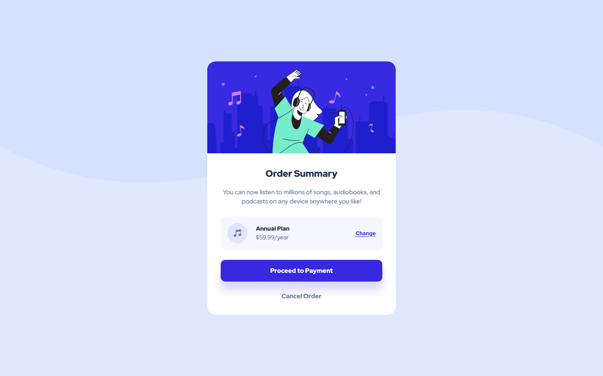

# Frontend Mentor - Order Summary-Component Solution

This is a solution to the [Order summary card challenge on Frontend Mentor](https://www.frontendmentor.io/challenges/order-summary-component-QlPmajDUj). Frontend Mentor challenges help you improve your coding skills by building realistic projects.

## Table of contents

- [Overview](#overview)
  - [Screenshots](#screenshots)
    - [Desktop solution](#desktop-solution)
    - [Mobile solution](#mobile-solution)
  - [Links](#links)
- [My process](#my-process)
  - [Built with](#built-with)
  - [Continued development](#continued-development)
- [Author](#author)

## Overview

### Screenshots

#### Desktop solution

#### Mobile solution

### Links

- Live Site URL: [https://almanzarsaul.github.io/frontend-mentor-order-summary/](https://almanzarsaul.github.io/frontend-mentor-order-summary/)

## My process

### Built with

- CSS custom properties
- CSS Grid
- CSS Flex
- Mobile-first workflow

### Continued development

In the future I would like to hone in on proper semantic HTML with a focus on accessibility, BEM CSS conventions, and cleaner CSS code.

## Author

- GitHub - [Saul Almanzar](https://github.com/almanzarsaul)
- Frontend Mentor - [@almanzarsaul](https://www.frontendmentor.io/profile/almanzarsaul)
